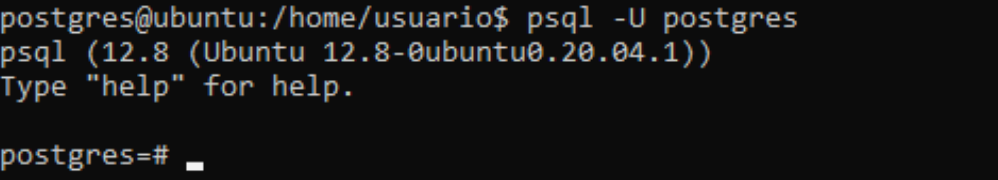
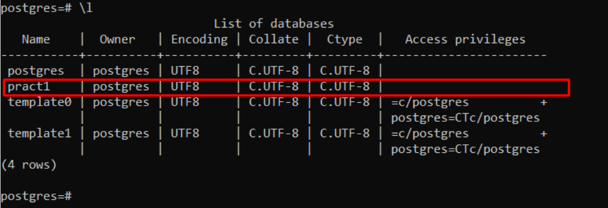
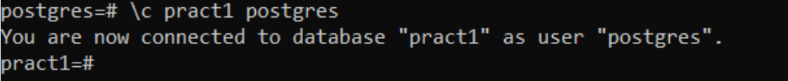
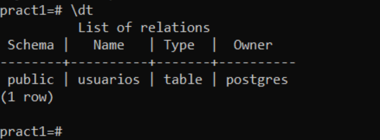
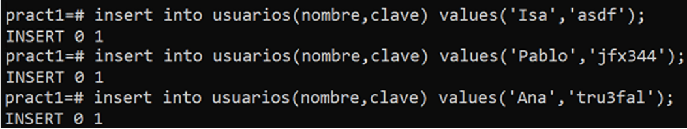
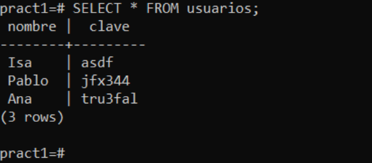

# Informe de Introducción a PostgreSQL.

## 1. Introducción.

En esta práctica instalaremos el sistema de gestión de bases de datos relacional orientado a objetos y de código abierto llamado PostgreSQL y para manejar el uso de dicho sistema, crearemos una base de datos de prueba. Para ello, trabajaremos en una máquina virtual soportada por el IaaS.

## 2. Instalación de PostgreSQL  y acceso al sistema.

En primer lugar, debemos entrar en el IaaS y acceder a la máquina de base de datos que nos han asignado. Una vez dentro, empezamos instalando PostgreSQL con el siguiente comando:

A continuación, accedemos al sistema con el superusuario **postgres**.

Tras haber entrado en PostgreSQL, para crear la base de datos de prueba sobre la que trabajaremos en esta práctica, es necesario identificarnos con el usuario *postgres*.

Seguidamente, podremos crear la base de datos de prueba mediante sentencias SQL y ejecutar ciertos comandos útiles que nos permitan saber información relevante del sistema.

## 3. Base de datos de prueba.

A continuación procedemos a crear una base de datos siguiendo el ejemplo planteado en la explicación de esta práctica.

### 3.1 Crear base de datos.

Lo primero que debemos hacer es crear una base de datos cuyo nombre será **pract1**, para ello introducimos el comando `CREATE DATABASE pract1`:

Para verificar que se ha creado la base de datos correctamente utilizamos el comando `\l` que nos servirá para listar las bases de datos en el servidor.

### 3.2 Crear tabla.

Una vez creada la base de datos, para trabajar con ella y poder crear una tabla, debemos conectarnos a la misma con el comando `\c dbname username` cuyo *dbname* corresponde al nombre de la base de datos y cuyo *username*, corresponde al usuario.

Ahora podremos trabajar con la base de datos **pract1**, por lo que procedemos a crear una tabla con el nombre **usuarios**. Para ello, ejecutamos lo siguiente:

Los **campos** nombre y clave hacen referencia a las columnas de las tablas. Estas almacenarán datos de tipo **varchar**, esto indica que serán caracteres de longitud variable con límite de 30 caracteres para nombre, y 10 para clave.

Una vez creamos la tabla, para comprobar que existe, utilizamos el comando `\dt` que nos permite listar las tablas en la base de datos actual.

### 3.3 Introducir datos en la tabla.

A continuación, introducimos 3 usuarios en la tabla anteriormente creada de la siguiente manera:

Como podemos observar para introducir dichos usuarios, especificamos el nombre de la tabla con las columnas a rellenar y los valores de dichas columnas respectivamente.

Ahora para comprobar que hemos introducido correctamente los datos en nuestra tabla, realizamos la siguiente consulta: `SELECT * FROM usuarios`. Nos permitirá mostrar **todos (\*)** los datos de la tabla **usuarios**.

Como podemos observar se han introducido correctamente los datos, por lo que hemos terminado de realizar nuestra base de datos de prueba.

Finalmente, para salir de la base de datos **pract1** ejecutamos el comando `\q` y a su vez, para salir del entorno de **PostgreSQL**, ejecutamos el comando `exit`.

## 4. Conclusión.

En conclusión, esta práctica nos ha servido para aprender acerca de **PostgreSQL** tanto en la creación de la base de datos como en la ejecución de comandos útiles que han permitido saber información relevante sobre el sistema. Además, como emplea el lenguaje SQL, no requiere dificultad su uso dado que este lenguaje lo hemos utilizado anteriormente. Cabe destacar que el manejo de dicho sistema, nos será beneficioso en esta asignatura para el aprendizaje sobre la administración y el diseño de las bases de datos.
